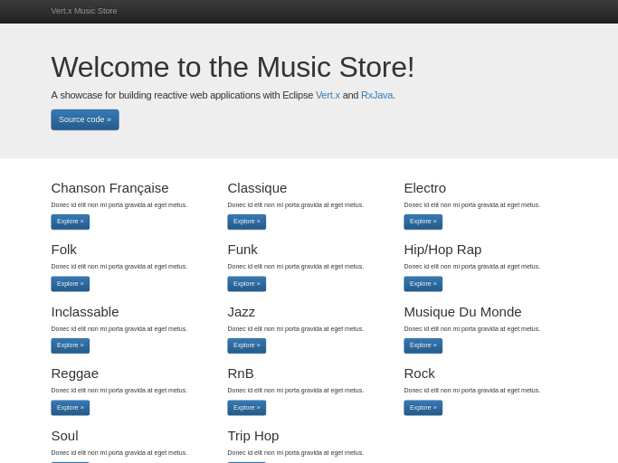

= The Music Store
:figure-caption!:

A demo Music Store with Eclipse Vert.x and RxJava

[cols=2,frame=none,grid=none]
|===

a|
:figure-caption!:
.Welcome Page

a|
:figure-caption!:
.Album page
image::album-page.png[Album]

|===

== Runnning

If you only want to try the application without modifying it, run the build and start the components with `docker-compose`.

[source,shell]
----
mvn clean package
docker-compose up
----

When all components are up browse to http://localhost:8080.

Otherwise start each component individually.

=== The Postgres database

[source,shell]
----
docker run --rm --name musicstore-db -e POSTGRES_USER=music -e POSTGRES_PASSWORD=music -e POSTGRES_DB=musicdb -p 5432:5432 postgres
----

=== The MongoDB server

[source,shell]
----
docker run --rm --name musicstore-mongo -p 27017:27017 mongo
----

=== Development

* Do one time build to pull the dependencies `mvn clean install`
* To run the application in foreground do `mvn vertx:run` with redeploy enabled
* To run the applicaiton in background mode i.e. vertx start do `mvn vertx:start`

Check https://reactiverse.io/vertx-maven-plugin/[vertx-maven-plugin] for more information and
examples on the plugin.

== Useful stuff

=== Initial dataset

The initial dataset has been created with the `initdb.groovy` script located at the project root.
It parses a https://wiki.gnome.org/Apps/Rhythmbox[Rhythmbox] database file and inserts the data into Postgres.

Then it's easy to create a script for Flyway.

[source,shell]
----
docker exec musicstore-db pg_dump -a --inserts --exclude-table=schema_version -h 127.0.0.1 -U music musicdb > src/main/resources/db/migration/V2__InsertData.sql
----
